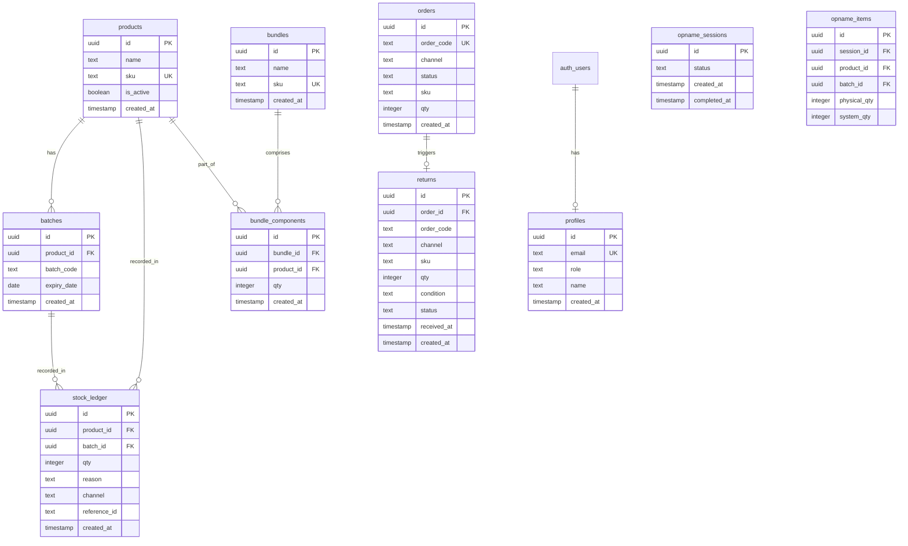

# StokLedger — Sistem Rekonsiliasi & Buku Besar Stok Gudang Skincare

[](#)
[](#)
[](#)

**Setiap pergerakan stok tercatat dan bisa ditelusuri — bukan sekadar angka selisih tanpa cerita.**

---

## 📋 1. Deskripsi

StokLedger adalah sistem pencatatan & rekonsiliasi stok inventaris mandiri (*stand-alone*) yang menggunakan satu **Buku Besar (Stock Ledger) append-only** sebagai satu-satunya sumber kebenaran data (*single source of truth*).

Sistem ini dirancang khusus untuk mengatasi kebocoran dan selisih stok fisik vs catatan pada brand skincare Indonesia yang memproduksi barang secara maklon dan berjualan di multi-marketplace (Shopee & TikTok Shop).

### Masalah yang Diselesaikan:

| Sumber Kebocoran | Solusi StokLedger |
|-----------------|-------------------|
| **Pesanan Batal** — stok sudah tercatat keluar, tapi tidak pernah dikembalikan | Cancel otomatis membalikkan (*reverse*) stok ke batch asal via ledger entry baru |
| **Retur Multi-kondisi** — layak jual, rusak, atau hilang di ekspedisi | Masing-masing kondisi punya alur ledger berbeda: layak jual → restok, rusak/hilang → restok sementara lalu discard (audit trail lengkap) |
| **Bonus/Promo/Sampel** — barang keluar tanpa tercatat sebagai apa-apa | Dicatat dengan **alasan khusus** (`bonus`, `promo`, `sampel`) — bukan campur aduk dengan penjualan |
| **Stok Awal Perkiraan** — selisih sudah terbentuk sebelum barang dijual | `reason: "saldo_awal"` dicatat sebagai entri ledger pertama, bukan asumsi 0 |

---

## 🎯 2. Kelebihan StokLedger Dibanding Sistem Lain

| Aspek | StokLedger | Spreadsheet Manual | Software Stok Konvensional |
|-------|-----------|-------------------|---------------------------|
| **Jejak audit** | Append-only ledger dengan trigger PostgreSQL — tidak bisa dihapus/diedit | Bisa diedit kapan saja tanpa jejak | Biasanya update-in-place, riwayat terbatas |
| **FEFO** | `SELECT FOR UPDATE` row locking — aman dari race condition | Manual — operator harus cek batch sendiri | Sering FIFO biasa, bukan FEFO |
| **Retur multi-kondisi** | 3 alur ledger berbeda (layak/rusak/hilang) dengan audit trail | Satu kolom "retur" — tidak bisa dibedakan | Biasanya hanya restok polos |
| **Pemisahan alasan vs kanal** | Kolom `reason` dan `channel` terpisah - tidak tercampur | Satu kolom catatan | Sering digabung |
| **Simulasi → API asli** | Arsitektur webhook handler yang tinggal ganti endpoint | Tidak relevan | Butuh integrasi ulang total |
| **Bundle breakdown** | Resep bundle otomatis dipecah ke komponen × qty order | Manual hitung sendiri | Sering tidak support |
| **Drill-down rekonsiliasi** | Klik selisih → lihat seluruh histori ledger produk | Tidak bisa | Terbatas |
| **Realtime** | SSR dengan server component + data real-time dari Supabase | Tidak real-time | Tergantung implementasi |
| **Mobile-friendly** | Sidebar drawer, touch targets 44px, scroll table | Tidak | Sering desktop-only |
| **Biaya** | Open source MIT + Supabase free tier | Gratis (Excel) | Berbayar / mahal |

### 🔑 Arsitektur yang Membedakan StokLedger

```
┌─────────────────────────────────────────────────────────────┐
│                    MARKETPLACE (Shopee/TikTok)               │
│                         (Simulasi / Webhook)                 │
└──────────┬──────────────────────────────────────┬───────────┘
           │ Order/Cancel/Retur                    │
           ▼                                        ▼
┌──────────────────────┐              ┌────────────────────────┐
│  /api/webhook/orders │              │  Form Manual (Client)  │
│  (Server Route)      │              │  /masuk, /manual, dll  │
│  ┌─────────────────┐ │              └───────────┬────────────┘
│  │ process_fefo    │ │                          │
│  │ process_cancel  │ │ RPC PostgreSQL            │ writeLedgerEntry()
│  │ process_return  │ │ (Atomic Transaction)      │ (Client→Server)
│  └─────────────────┘ │                          │
└──────────┬───────────┘                          │
           │ INSERT / SELECT                       │
           ▼                                        ▼
┌─────────────────────────────────────────────────────────────┐
│                    stock_ledger TABLE                         │
│  (Append-only — TRIGGER blokir UPDATE/DELETE)                 │
│  Index: product_id, batch_id, created_at                     │
├─────────────────────────────────────────────────────────────┤
│  product_stock_summary VIEW    │ batch_stock_summary VIEW    │
│  (SUM(qty) per produk)         │ (SUM(qty) per batch)        │
├─────────────────────────────────────────────────────────────┤
│  daily_reconciliation_summary VIEW                            │
│  (Order vs Ledger discrepancy detection)                     │
└─────────────────────────────────────────────────────────────┘
```

---

## ✨ 3. Fitur Utama

- **Buku Besar Append-Only**: PostgreSQL Trigger `prevent_ledger_update_delete` memblokir UPDATE/DELETE. Setiap koreksi = baris baru.
- **Alokasi Batch FEFO Otomatis**: Barang keluar dipotong dari batch dengan expired terdekat. Tidak ada pilihan batch manual untuk operator.
- **Atomic FEFO dengan Row Locking**: RPC `process_order_fefo` menggunakan `SELECT FOR UPDATE` untuk mencegah race condition.
- **Atomic Cancel Order**: RPC `process_cancel_order` membalikkan stok + update status order dalam satu transaksi.
- **Retur Server-side**: RPC `process_return` memproses retur (layak jual/rusak/hilang) di server dengan atomic transaction.
- **Pecah Resep Bundle**: SKU bundle diurai menjadi produk satuan × qty order, FEFO dijalankan per komponen.
- **2 Ritme Rekonsiliasi**: Harian (cek konsistensi ledger vs order) + Opname (banding fisik vs sistem).
- **Drill-down Rekonsiliasi**: Klik item selisih → audit trail seluruh pergerakan produk dari Buku Besar.
- **High Performance Database Views**: `product_stock_summary`, `batch_stock_summary`, `daily_reconciliation_summary` — menghilangkan N+1 query.
- **Ekspor XLSX Premium**: Excel dengan header Rose Quartz Peach, auto-filter, multi-sheet, ringkasan.
- **Mobile Responsive**: Sidebar drawer, touch targets 44px, horizontal scroll table.
- **Manajemen Anggota**: 3 role (Gudang, Admin, Owner) + Owner dapat mendaftarkan user baru.
- **Simulasi Marketplace**: Tombol simulasi + import CSV + arsitektur siap ganti API asli.

---

## 🖥️ 4. Tampilan Antarmuka

| Area | Deskripsi |
|------|-----------|
| **Theme** | Rose Quartz Peach (`#D48C88`) + Dark Clay Espresso (`#3A1E1C`) — nuansa skincare premium, bukan pink generik |
| **Font** | Space Grotesk (heading) + IBM Plex Mono (angka/kode) + Inter (body) |
| **Dashboard** | 4 metrik + widget anomali + recent ledger + navigasi cepat |
| **Buku Besar** | Tampilan dashed receipt paper, filter multi-kriteria, ekspor XLSX |
| **Rekonsiliasi** | 2 tab dengan drill-down audit trail per produk |
| **Mobile** | Sidebar drawer + hamburger menu + backdrop overlay |

---

## 🛠️ 5. Tech Stack

| Layer | Teknologi |
|-------|-----------|
| **Framework** | Next.js 14 (App Router) |
| **Language** | TypeScript 5 |
| **Styling** | Tailwind CSS 3 |
| **Database** | Supabase (PostgreSQL) |
| **Auth** | Supabase Auth (email/password) |
| **Server Logic** | PostgreSQL Functions (RPC) untuk atomic operations |
| **Export** | SheetJS (XLSX) |

---

## 🗄️ 6. ERD (Entity Relationship Diagram)



---

## 📁 7. Database Migrations (Urutan Eksekusi)

Jalankan query SQL berikut di **SQL Editor Supabase**:

*   **`supabase/migrations/20260709000006_full_sql_editor.sql`** — Satu file terpadu yang berisi inisialisasi skema tabel, indeks optimasi performa, trigger append-only, views, RPC functions, serta data dummy awal produk & promo.

---

## 📦 8. Instalasi

### Prasyarat
- Node.js 18+
- Akun Supabase (free tier cukup)

### Langkah

```bash
# 1. Clone
git clone <repo-url>
cd VibeDev-Bounty

# 2. Install dependencies
npm install

# 3. Set environment variables
cp .env.example .env
# Edit .env dengan credentials Supabase Anda (URL, Anon Key, Service Role Key)

# 4. Inisialisasi database
# Jalankan file migration full_sql_editor.sql di SQL Editor Supabase (lihat bagian 7)

# 5. Seed akun tester
curl http://localhost:3055/api/seed-users

# 6. Jalankan development
npm run dev
# Buka http://localhost:3055
```

### Akun Tester

| Role | Email | Password |
|------|-------|----------|
| **Admin** (Config) | admin@stokledger.com | password123 |

---

## ⚙️ 9. Konfigurasi Environment

```env
NEXT_PUBLIC_SUPABASE_URL=https://your-project-id.supabase.co
NEXT_PUBLIC_SUPABASE_ANON_KEY=your-anon-key
SUPABASE_SERVICE_ROLE_KEY=your-service-role-key
```

---

## 📂 10. Struktur Folder

```
project/
├── src/
│   ├── app/
│   │   ├── (dashboard)/         # Rute Halaman Dashboard (rekonsiliasi, produk, retur, promo, dll)
│   │   ├── api/
│   │   │   ├── webhook/orders/  # Route handler simulasi & promo otomatis
│   │   │   ├── users/           # Manajemen anggota (Owner only)
│   │   │   └── seed-users/      # Seeder akun tester
│   │   └── login/               # Halaman login email+password & demo
│   ├── components/
│   │   ├── layout/              # Sidebar (Drawer mobile), Topbar (jejak banner & hamburger)
│   │   ├── ui/                  # Atom UI (Button, Input, Tag, SectionCard, ScrollTable, Alert, Loading)
│   │   └── icons/               # Custom SVG icon set (12 icons including IconFlask)
│   ├── lib/
│   │   ├── supabase/            # client.ts, server.ts (Supabase helpers)
│   │   ├── fefo.ts              # Algoritma FEFO (client-side, untuk form manual)
│   │   ├── ledger.ts            # Helper read/write ledger
│   │   └── export.ts            # XLSX export utility dengan styling tema Rose Quartz
│   ├── types/                   # TypeScript types (Product, Batch, LedgerEntry, dll)
│   └── context/                 # UserContext (auth session + profile)
└── supabase/
    └── migrations/              # SQL migrations (6 file, urut sesuai nomor)
```

---

## 🔄 11. Alur Logika Stok (End-to-End)

```
Barang Masuk Maklon
  → Form /masuk
  → writeLedgerEntry(qty: +, reason: "masuk_maklon", channel: "system")
  → Batch otomatis dibuat jika belum ada

Order Marketplace (Simulasi)
  → Buat order (PENDING) — TIDAK menyentuh stock_ledger
  → Kirim (SHIPPED/IN_TRANSIT)
  → RPC process_order_fefo (SELECT FOR UPDATE + INSERT)
  → Bundle → pecah komponen → FEFO per komponen
  → Stok berkurang di batch expired terdekat

Cancel Order (SHIPPED → CANCELLED)
  → RPC process_cancel_order (atomic transaction)
  → Reversal: INSERT +qty ke batch asal
  → Update order status CANCELLED

Retur Masuk
  → Tombol "Retur" → simpan di returns table (PENDING)
  → Tab Inspeksi → pilih kondisi (Layak/Rusak/Hilang)
  → RPC process_return (atomic transaction)
  → Layak jual → restok batch asal
  → Rusak → restok sementara + discard (2 entry ledger)
  → Hilang → restok sementara + loss (2 entry ledger)

Barang Keluar Manual
  → Form /manual
  → Pilih alasan (bonus/promo/sampel/offline/rusak/expired)
  → allocateBatchFefo() pilih batch expired terdekat
  → writeLedgerEntry(qty: -, reason: [alasan], channel: "manual")

Stok Opname
  → Mulai sesi → draft (input fisik)
  → Simpan draft (berkali-kali, tidak sentuh ledger)
  → Selesaikan → writeLedgerEntry(qty: diff, reason: "opname_koreksi")
  → Setelah ledger aman → session ditandai completed
```

---

## 🧪 12. Skenario Demo yang Disarankan

**Total ~15 menit:**

1. **Login** → Dashboard (lihat metrik + anomali) → 2 menit
2. **Barang Masuk** → input 1000 unit DNA Salmon → 2 menit
3. **Simulasi Order** → buat order Shopee → Kirim → cek FEFO di Buku Besar → 3 menit
4. **Cancel & Retur** → batalkan order → retur dengan kondisi rusak → cek audit trail di ledger → 3 menit
5. **Keluar Manual** → input bonus 5 unit → cek alasan terpisah → 1 menit
6. **Rekonsiliasi** → tab Harian → lihat selisih → klik "Audit Alur Stok" → 2 menit
7. **Ekspor XLSX** → download Excel dengan tema Rose Quartz → 1 menit
8. **Notifikasi** → lihat peringatan expiry + klaim TikTok → 1 menit

---

## 📜 13. Lisensi

Proyek ini berada di bawah lisensi **MIT** — bebas digunakan, dimodifikasi, dan didistribusikan.

---

## 📬 14. Kontak

- **Maintainer**: Tim Pengembang VibeDev
- **Issue / Feedback**: Laporkan di [GitHub Issues](https://github.com/anomalyco/opencode/issues)
