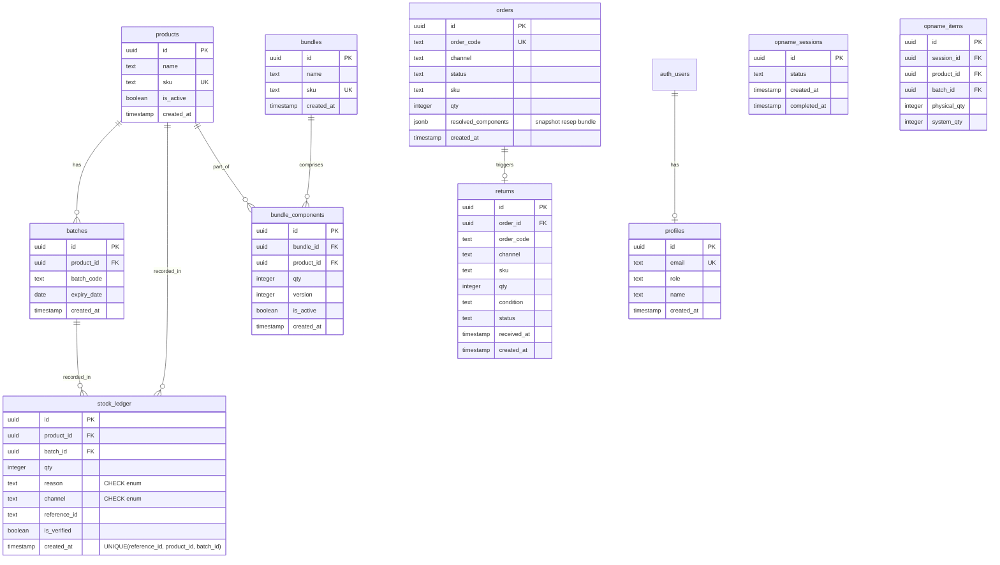

# StokLedger — Sistem Rekonsiliasi & Buku Besar Stok Gudang Skincare

[](#)
[](#)
[](#)

**Setiap pergerakan stok tercatat dan bisa ditelusuri — bukan sekadar angka selisih tanpa cerita.**

---

## 📋 1. Deskripsi

StokLedger adalah sistem pencatatan & rekonsiliasi stok inventaris mandiri (*stand-alone*) yang menggunakan satu **Buku Besar (Stock Ledger) append-only** sebagai satu-satunya sumber kebenaran data (*single source of truth*).

Sistem ini dirancang khusus untuk mengatasi kebocoran dan selisih stok fisik vs catatan pada brand skincare Indonesia yang memproduksi barang secara maklon dan berjualan di multi-marketplace (Shopee & TikTok Shop).

### Masalah yang Diselesaikan:

| Sumber Kebocoran | Solusi StokLedger |
|-----------------|-------------------|
| **Pesanan Batal** — stok sudah tercatat keluar, tapi tidak pernah dikembalikan | Cancel otomatis membalikkan (*reverse*) stok ke batch asal via ledger entry baru |
| **Retur Multi-kondisi** — layak jual, rusak, atau hilang di ekspedisi | Masing-masing kondisi punya alur ledger berbeda: layak jual → restok, rusak/hilang → restok sementara lalu discard (audit trail lengkap) |
| **Bonus/Promo/Sampel** — barang keluar tanpa tercatat sebagai apa-apa | Dicatat dengan **alasan khusus** (`bonus`, `promo`, `sampel`) — bukan campur aduk dengan penjualan |
| **Stok Awal Perkiraan** — selisih sudah terbentuk sebelum barang dijual | `reason: "saldo_awal"` dicatat sebagai entri ledger pertama, bukan asumsi 0 |

---

## 🎯 2. Kelebihan StokLedger Dibanding Sistem Lain

| Aspek | StokLedger | Spreadsheet Manual | Software Stok Konvensional |
|-------|-----------|-------------------|---------------------------|
| **Jejak audit** | Append-only ledger dengan trigger PostgreSQL — tidak bisa dihapus/diedit | Bisa diedit kapan saja tanpa jejak | Biasanya update-in-place, riwayat terbatas |
| **FEFO** | `SELECT FOR UPDATE` row locking — aman dari race condition | Manual — operator harus cek batch sendiri | Sering FIFO biasa, bukan FEFO |
| **Retur multi-kondisi** | 3 alur ledger berbeda (layak/rusak/hilang) dengan audit trail | Satu kolom "retur" — tidak bisa dibedakan | Biasanya hanya restok polos |
| **Pemisahan alasan vs kanal** | Kolom `reason` dan `channel` terpisah - tidak tercampur | Satu kolom catatan | Sering digabung |
| **Simulasi → API asli** | Arsitektur webhook handler yang tinggal ganti endpoint | Tidak relevan | Butuh integrasi ulang total |
| **Bundle breakdown** | Resep bundle otomatis dipecah ke komponen × qty order | Manual hitung sendiri | Sering tidak support |
| **Drill-down rekonsiliasi** | Klik selisih → lihat seluruh histori ledger produk | Tidak bisa | Terbatas |
| **Realtime** | SSR dengan server component + data real-time dari Supabase | Tidak real-time | Tergantung implementasi |
| **Mobile-friendly** | Sidebar drawer, touch targets 44px, scroll table | Tidak | Sering desktop-only |
| **Biaya** | Open source MIT + Supabase free tier | Gratis (Excel) | Berbayar / mahal |

### 🔑 Arsitektur yang Membedakan StokLedger

```
┌─────────────────────────────────────────────────────────────┐
│                    MARKETPLACE (Shopee/TikTok)               │
│                         (Simulasi / Webhook)                 │
└──────────┬──────────────────────────────────────┬───────────┘
           │ Order/Cancel/Retur/Import             │
           ▼                                        ▼
┌──────────────────────┐              ┌────────────────────────┐
│  /api/webhook/orders │              │  /api/ledger           │
│  (Marketplace Events)│              │  (Admin Operations)    │
│  ┌─────────────────┐ │              │  ┌──────────────────┐  │
│  │ process_fefo    │ │              │  │ manual_stock_out │  │
│  │ process_cancel  │ │              │  │ create_ledger    │  │
│  │ process_return  │ │              │  │ complete_opname  │  │
│  │ import_orders   │ │              │  └──────────────────┘  │
│  └─────────────────┘ │              └───────────┬────────────┘
└──────────┬───────────┘                          │
           │ RPC PostgreSQL (Atomic Transaction)   │
           ▼                                        ▼
┌─────────────────────────────────────────────────────────────┐
│                    stock_ledger TABLE                         │
│  (Append-only — TRIGGER + REVOKE UPDATE/DELETE)              │
│  Unique: (reference_id, product_id, batch_id) ← idempotency │
│  CHECK: reason ∈ {enum}, channel ∈ {enum}                    │
├─────────────────────────────────────────────────────────────┤
│  product_stocks_cache   │ batch_stocks_cache                 │
│  (Trigger-maintained    │ (Trigger-maintained                │
│   O(1) running balance) │  O(1) running balance)             │
├─────────────────────────────────────────────────────────────┤
│  product_stock_summary VIEW    │ batch_stock_summary VIEW    │
│  (JOIN cache, bukan SUM)       │ (JOIN cache, bukan SUM)     │
├─────────────────────────────────────────────────────────────┤
│  daily_reconciliation_summary VIEW                            │
│  (Order vs Ledger discrepancy detection)                     │
└─────────────────────────────────────────────────────────────┘
```

---

## ✨ 3. Fitur Utama

- **Buku Besar Append-Only**: PostgreSQL Trigger `prevent_ledger_update_delete` memblokir UPDATE/DELETE. Setiap koreksi = baris baru.
- **Immutability Berlapis**: Trigger + `REVOKE UPDATE, DELETE ON stock_ledger FROM authenticated` + RLS policy INSERT-only.
- **Idempotency Event**: Unique index `(reference_id, product_id, batch_id)` + cek duplikat di setiap RPC mencegah double-processing.
- **Alokasi Batch FEFO Otomatis**: Barang keluar dipotong dari batch dengan expired terdekat. Tidak ada pilihan batch manual untuk operator.
- **Atomic FEFO dengan Row Locking**: RPC `process_order_fefo` menggunakan `SELECT FOR UPDATE` untuk mencegah race condition.
- **Atomic Cancel Order + Parsial**: RPC `process_cancel_order` membalikkan stok (penuh atau parsial per qty) + update status order dalam satu transaksi.
- **Retur Server-side + Bundle Breakdown**: RPC `process_return` memproses retur per komponen bundle (menggunakan snapshot `resolved_components`), mendukung layak jual/rusak/hilang.
- **Pecah Resep Bundle + Versioning**: SKU bundle diurai menjadi produk satuan × qty order, snapshot resep disimpan di `orders.resolved_components` JSONB saat dikirim — aman dari perubahan resep di masa depan.
- **O(1) Stock Reads**: Cache table `product_stocks_cache` & `batch_stocks_cache` di-maintain via trigger on ledger insert — bukan SUM full-scan.
- **Server-Side Ledger Writes**: Semua penulisan ledger lewat RPC/Server Action (`/api/ledger` untuk manual/opname, `/api/webhook/orders` untuk marketplace).
- **DB-Level Constraint**: CHECK constraint `reason` dan `channel` di database — bukan hanya validasi TypeScript.
- **2 Ritme Rekonsiliasi**: Harian (cek konsistensi ledger vs order) + Opname (banding fisik vs sistem).
- **Drill-down Rekonsiliasi**: Klik item selisih → audit trail seluruh pergerakan produk dari Buku Besar.
- **Koreksi Entri Terpisah**: Tombol "Koreksi" reversal cepat (reason: `koreksi_salah_input`) terpisah dari "Penyesuaian Opname" (reason: `opname_koreksi`).
- **Saldo Awal Terverifikasi**: Entri `saldo_awal` bertanda `is_verified = false` sampai opname pertama memverifikasi.
- **Ekspor XLSX Premium**: Excel dengan header Rose Quartz Peach, auto-filter, multi-sheet, ringkasan.
- **Mobile Responsive**: Sidebar drawer, touch targets 44px, horizontal scroll table.
- **Simulasi Marketplace**: Tombol simulasi + import CSV (lewat API route) + arsitektur siap ganti API asli.

---

## 🖥️ 4. Tampilan Antarmuka

| Area | Deskripsi |
|------|-----------|
| **Theme** | Rose Quartz Peach (`#D48C88`) + Dark Clay Espresso (`#3A1E1C`) — nuansa skincare premium, bukan pink generik |
| **Font** | Space Grotesk (heading) + IBM Plex Mono (angka/kode) + Inter (body) |
| **Dashboard** | 4 metrik + widget anomali + recent ledger + navigasi cepat |
| **Buku Besar** | Tampilan dashed receipt paper, filter multi-kriteria, ekspor XLSX |
| **Rekonsiliasi** | 2 tab dengan drill-down audit trail per produk |
| **Mobile** | Sidebar drawer + hamburger menu + backdrop overlay |

---

## 🛠️ 5. Tech Stack

| Layer | Teknologi |
|-------|-----------|
| **Framework** | Next.js 14 (App Router) |
| **Language** | TypeScript 5 |
| **Styling** | Tailwind CSS 3 |
| **Database** | Supabase (PostgreSQL) |
| **Auth** | Supabase Auth (email/password) |
| **Server Logic** | PostgreSQL Functions (RPC) untuk atomic operations |
| **Export** | SheetJS (XLSX) |

---

## 🗄️ 6. ERD (Entity Relationship Diagram)


```mermaid
erDiagram
    products ||--o{ batches : "has"
    products ||--o{ stock_ledger : "recorded_in"
    batches ||--o{ stock_ledger : "recorded_in"
    products ||--o{ bundle_components : "part_of"
    bundles ||--o{ bundle_components : "comprises"
    orders ||--o| returns : "triggers"
    auth_users ||--o| profiles : "has"

    products {
        uuid id PK
        text name
        text sku UK
        boolean is_active
        timestamp created_at
    }

    batches {
        uuid id PK
        uuid product_id FK
        text batch_code
        date expiry_date
        timestamp created_at
    }

    stock_ledger {
        uuid id PK
        uuid product_id FK
        uuid batch_id FK
        integer qty
        text reason "CHECK enum"
        text channel "CHECK enum"
        text reference_id
        boolean is_verified
        timestamp created_at
        "UNIQUE(reference_id, product_id, batch_id)"
    }

    bundles {
        uuid id PK
        text name
        text sku UK
        timestamp created_at
    }

    bundle_components {
        uuid id PK
        uuid bundle_id FK
        uuid product_id FK
        integer qty
        integer version
        boolean is_active
        timestamp created_at
    }

    orders {
        uuid id PK
        text order_code UK
        text channel
        text status
        text sku
        integer qty
        jsonb resolved_components "snapshot resep bundle"
        timestamp created_at
    }

    returns {
        uuid id PK
        uuid order_id FK
        text order_code
        text channel
        text sku
        integer qty
        text condition
        text status
        timestamp received_at
        timestamp created_at
    }

    opname_sessions {
        uuid id PK
        text status
        timestamp created_at
        timestamp completed_at
    }

    opname_items {
        uuid id PK
        uuid session_id FK
        uuid product_id FK
        uuid batch_id FK
        integer physical_qty
        integer system_qty
    }

    profiles {
        uuid id PK
        text email UK
        text role
        text name
        timestamp created_at
    }
```

---

## 📁 7. Database Migrations (Urutan Eksekusi)

Jalankan query SQL berikut di **SQL Editor Supabase**, secara berurutan:

1. **`supabase/migrations/20260709000006_full_sql_editor.sql`** — Skema tabel, trigger append-only, views, RPC functions, data dummy.
2. **`supabase/migrations/20260709000007_phase2_updates.sql`** — Kolom `is_verified` pada ledger, update trigger agar izinkan update `is_verified`, retur rusak/hilang tanpa ledger write.
3. **`supabase/migrations/20260709000008_fefo_resolved_cache.sql`** — Cache table `product_stocks_cache` & `batch_stocks_cache`, trigger sinkronisasi, rewrite views ke cache, kolom `resolved_components` pada orders, RPC `create_ledger_entry`.
4. **`supabase/migrations/20260709000009_phase2_fixes.sql`** — Idempotency index, CHECK constraint reason/channel, REVOKE UPDATE/DELETE, bundle versioning, rewrite semua RPC (FEFO idempoten, cancel parsial, retur bundle components, manual ledger entry, opname corrections).

> **Penting**: Jika sudah menjalankan migration 6, jalankan migration 7, 8, 9 secara berurutan. Jika mendapat error tipe data view, pastikan migration 8 menyertakan `DROP VIEW IF EXISTS ... CASCADE` di awal.

---

## 📦 8. Instalasi

### Prasyarat
- Node.js 18+
- Akun Supabase (free tier cukup)

### Langkah

```bash
# 1. Clone
git clone <repo-url>
cd VibeDev-Bounty

# 2. Install dependencies
npm install

# 3. Set environment variables
cp .env.example .env
# Edit .env dengan credentials Supabase Anda (URL, Anon Key, Service Role Key)

# 4. Inisialisasi database
# Jalankan file migration full_sql_editor.sql di SQL Editor Supabase (lihat bagian 7)

# 5. Seed akun tester
curl http://localhost:3055/api/seed-users

# 6. Jalankan development
npm run dev
# Buka http://localhost:3055
```

### Akun Tester

| Role | Email | Password |
|------|-------|----------|
| **Admin** (Config) | admin@stokledger.com | password123 |

---

## ⚙️ 9. Konfigurasi Environment

```env
NEXT_PUBLIC_SUPABASE_URL=https://your-project-id.supabase.co
NEXT_PUBLIC_SUPABASE_ANON_KEY=your-anon-key
SUPABASE_SERVICE_ROLE_KEY=your-service-role-key
```

---

## 📂 10. Struktur Folder

```
project/
├── src/
│   ├── app/
│   │   ├── (dashboard)/         # Rute Halaman Dashboard (rekonsiliasi, produk, retur, promo, dll)
│   │   ├── api/
│   │   │   ├── webhook/orders/  # Route handler simulasi marketplace & promo otomatis
│   │   │   ├── ledger/          # Route handler manual stock-out, opname, ledger entry (admin ops)
│   │   │   ├── users/           # Manajemen anggota
│   │   │   └── seed-users/      # Seeder akun tester
│   │   └── login/               # Halaman login email+password & demo
│   ├── components/
│   │   ├── layout/              # Sidebar (Drawer mobile), Topbar (jejak banner & hamburger)
│   │   ├── ui/                  # Atom UI (Button, Input, Tag, SectionCard, ScrollTable, Alert, Loading)
│   │   └── icons/               # Custom SVG icon set (12 icons including IconFlask)
│   ├── lib/
│   │   ├── supabase/            # client.ts, server.ts (Supabase helpers)
│   │   ├── fefo.ts              # Algoritma FEFO (client-side preview, server-side execution)
│   │   ├── ledger.ts            # Helper write ledger (via /api/ledger server route)
│   │   ├── labels.ts            # Shared reason/channel labels (DRY, satu sumber)
│   │   └── export.ts            # XLSX export utility dengan styling tema Rose Quartz
│   ├── types/                   # TypeScript types (Product, Batch, LedgerEntry, dll)
│   └── context/                 # UserContext (auth session + profile)
├── supabase/
│   └── migrations/              # SQL migrations (4 file utama, urut 6→7→8→9)
└── vercel.json                  # Deployment config Vercel
```

---

## 🔄 11. Alur Logika Stok (End-to-End)

```
Barang Masuk Maklon
  → Form /manual
  → POST /api/ledger {action: "create_ledger_entry"}
  → RPC create_manual_ledger_entry (idempoten)
  → Batch otomatis dibuat jika belum ada

Order Marketplace (Simulasi)
  → Buat order (PENDING) — TIDAK menyentuh stock_ledger
  → Kirim (SHIPPED/IN_TRANSIT)
  → POST /api/webhook/orders {action: "update_order_status"}
  → RPC process_order_fefo (SELECT FOR UPDATE + idempotency check)
  → Bundle → pecah komponen → snapshot ke resolved_components → FEFO per komponen
  → Stok berkurang di batch expired terdekat

Cancel Order (SHIPPED → CANCELLED)
  → POST /api/webhook/orders {action: "update_order_status", new_status: "CANCELLED"}
  → RPC process_cancel_order (penuh atau parsial via p_cancel_qty)
  → Reversal: INSERT +qty ke batch asal
  → Idempotency: skip jika CANCEL-REFUND-{code} sudah ada

Retur Masuk
  → Tombol "Retur" → simpan di returns table (PENDING)
  → Tab Inspeksi → pilih kondisi (Layak/Rusak/Hilang)
  → POST /api/webhook/orders {action: "process_return"}
  → RPC process_return (menerima resolved_components untuk bundle breakdown)
  → Layak jual → batch baru (prefix RETUR-) + stok masuk
  → Rusak/Hilang → TIDAK ada ledger write (stok sudah terpotong saat shipped)

Barang Keluar Manual
  → Form /manual
  → Pilih alasan (bonus/promo/sampel/offline/rusak/expired)
  → POST /api/ledger {action: "manual_stock_out"}
  → RPC process_order_fefo otomatis pilih batch FEFO

Stok Opname
  → Mulai sesi → draft (input fisik dari cache)
  → Simpan draft (berkali-kali, tidak sentuh ledger)
  → Selesaikan → POST /api/ledger {action: "complete_opname"}
  → RPC create_opname_corrections (atomic: ledger + verify saldo_awal + complete session)

Koreksi Salah Input
  → Tombol "Koreksi" di halaman Buku Besar
  → POST /api/ledger {action: "create_ledger_entry"}
  → Entri baru reason: "koreksi_salah_input" dengan qty terbalik
```

---

## 🔧 12. Changelog Phase 2 (Sync Update)

Perubahan utama dari Phase 1 ke Phase 2:

| Area | Perubahan | File Terdampak |
|------|-----------|----------------|
| **Idempotency** | Unique index `(reference_id, product_id, batch_id)` + cek duplikat di semua RPC | `20260709000009_phase2_fixes.sql` |
| **Server-Side Writes** | Semua client-side `stock_ledger` insert dihapus, dialihkan ke `/api/ledger` route yang memanggil RPC | `lib/ledger.ts`, `api/ledger/route.ts`, `manual/page.tsx`, `opname/page.tsx`, `ProdukClient.tsx` |
| **API Separation** | Marketplace events (`/api/webhook/orders`) dipisah dari admin ops (`/api/ledger`) | `api/webhook/orders/route.ts`, `api/ledger/route.ts` |
| **Bundle Versioning** | Snapshot resep bundle disimpan di `orders.resolved_components` JSONB saat dikirim | `api/webhook/orders/route.ts`, `20260709000009_phase2_fixes.sql` |
| **Retur Bundle** | `process_return` RPC sekarang menerima `resolved_components` untuk breakdown per komponen | `api/webhook/orders/route.ts`, `20260709000009_phase2_fixes.sql` |
| **Cancel Parsial** | `process_cancel_order` RPC mendukung `p_cancel_qty` untuk pembatalan sebagian | `20260709000009_phase2_fixes.sql` |
| **O(1) Stock Cache** | Cache table `product_stocks_cache` & `batch_stocks_cache` + trigger sinkronisasi | `20260709000008_fefo_resolved_cache.sql` |
| **DB Constraints** | CHECK constraint `reason` dan `channel` di database level | `20260709000009_phase2_fixes.sql` |
| **REVOKE** | `REVOKE UPDATE, DELETE ON stock_ledger FROM authenticated` | `20260709000009_phase2_fixes.sql` |
| **DRY Labels** | `getReasonLabel` & `getChannelLabel` dipindah ke `lib/labels.ts` (satu sumber) | `lib/labels.ts`, semua komponen client |
| **Single Role Admin** | Semua user = Admin penuh, tidak ada restriksi menu/role | `Sidebar.tsx`, semua page (isReadOnly=false) |
| **Saldo Awal Verified** | Kolom `is_verified` pada ledger, saldo_awal unverified sampai opname | `20260709000007_phase2_updates.sql` |
| **Cleanup** | Hapus folder kosong `components/features/`, placeholder URL, tambah `vercel.json` | `client.ts`, `vercel.json` |

---

## 🧪 13. Skenario Demo yang Disarankan

**Total ~15 menit:**

1. **Login** → Dashboard (lihat metrik + anomali) → 2 menit
2. **Barang Masuk** → input 1000 unit DNA Salmon → 2 menit
3. **Simulasi Order** → buat order Shopee → Kirim → cek FEFO di Buku Besar → 3 menit
4. **Cancel & Retur** → batalkan order → retur dengan kondisi rusak → cek audit trail di ledger → 3 menit
5. **Keluar Manual** → input bonus 5 unit → cek alasan terpisah → 1 menit
6. **Rekonsiliasi** → tab Harian → lihat selisih → klik "Audit Alur Stok" → 2 menit
7. **Ekspor XLSX** → download Excel dengan tema Rose Quartz → 1 menit
8. **Notifikasi** → lihat peringatan expiry + klaim TikTok → 1 menit

---

## 📜 14. Lisensi

Proyek ini berada di bawah lisensi **MIT** — bebas digunakan, dimodifikasi, dan didistribusikan.

---

## 📬 15. Kontak

- **Maintainer**: Tim Pengembang VibeDev
- **Issue / Feedback**: Laporkan di [GitHub Issues](https://github.com/anomalyco/opencode/issues)
